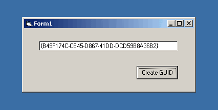



## GetGuidID

### Description

This code creates a Genuinely Unique Identification Number,

{XXXXXXXX-XXXX-XXXX-XXXX-XXXXXXXXXXXX}
 
### More Info
 
A Genuinely Unique Identification Number (GUID)

             |
---                |---
**Submitted On**   |2001-07-21 14:57:56
**By**             |[Vassilis Antonoulas](https://github.com/Planet-Source-Code/PSCIndex/blob/master/ByAuthor/vassilis-antonoulas.md)
**Level**          |Intermediate
**User Rating**    |4.7 (14 globes from 3 users)
**Compatibility**  |VB 6\.0
**Category**       |[Miscellaneous](https://github.com/Planet-Source-Code/PSCIndex/blob/master/ByCategory/miscellaneous__1-1.md)
**World**          |[Visual Basic](https://github.com/Planet-Source-Code/PSCIndex/blob/master/ByWorld/visual-basic.md)
**Archive File**   |[GetGuidID231947212001\.zip](https://github.com/Planet-Source-Code/vassilis-antonoulas-getguidid__1-25285/archive/master.zip)

